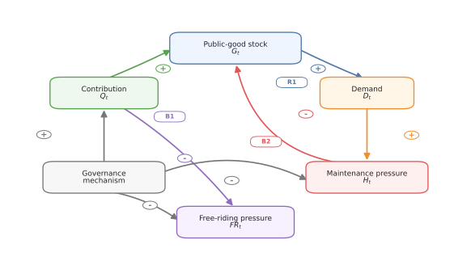
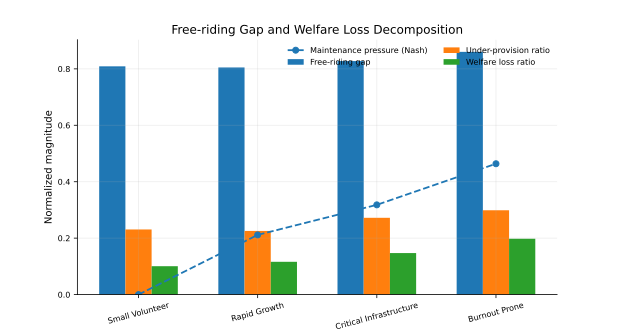
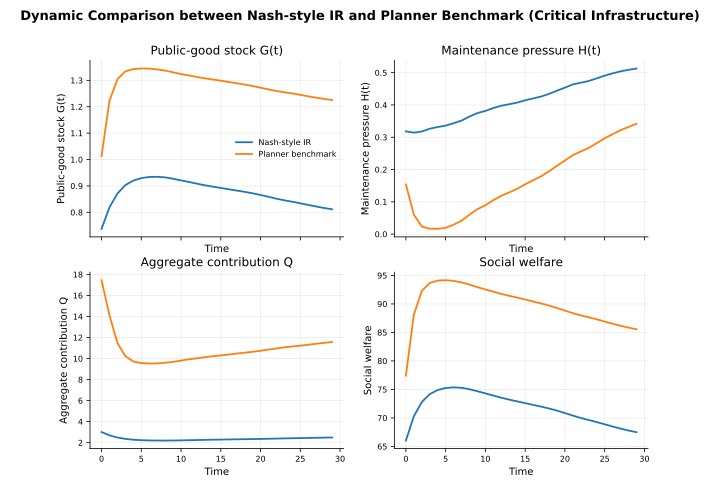
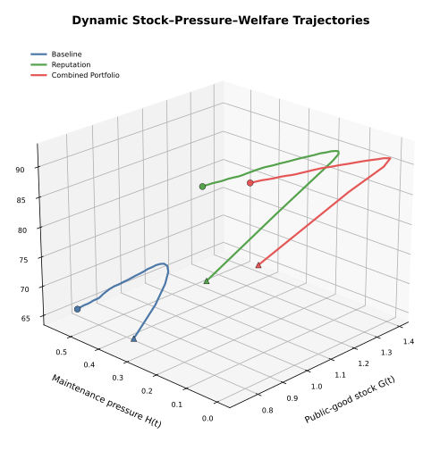
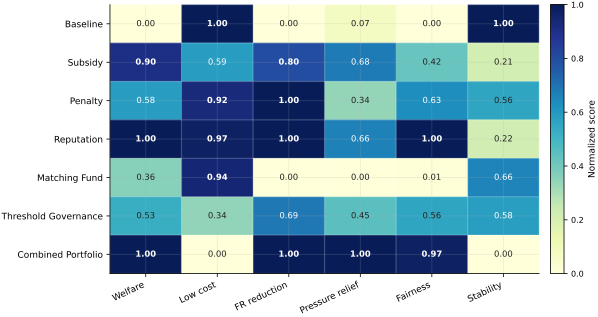
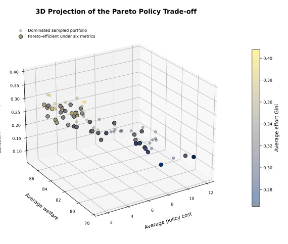
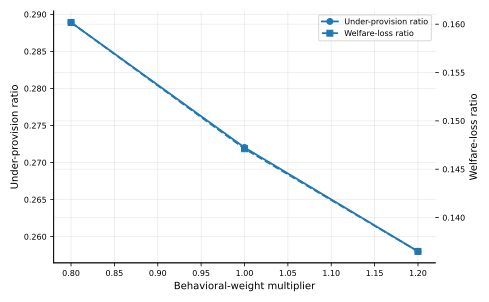
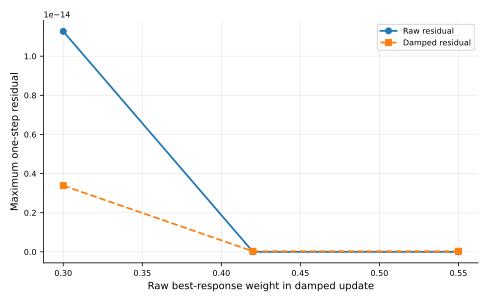
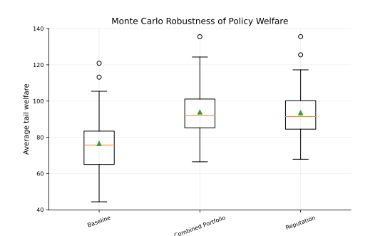

## 1. Problem Setting

This project studies free riding in dynamic public-good provision. Public goods such as environmental governance, open-source maintenance, public infrastructure, and community services share a common structure: individual contribution improves a collective stock, but the contribution cost is borne privately.

This creates a free-riding incentive. Each participant may prefer others to contribute more while reducing their own effort. As a result, decentralized individual rationality can lead to persistent under-provision, accumulated maintenance pressure, and welfare loss.

The goal of this project is to build a mechanism-oriented mathematical model that explains this dynamic process and evaluates possible governance interventions. The project is designed as a simulation-based mathematical modeling study rather than an empirical forecasting task.

## 2. Modeling Framework

  

The project develops a simulation-based **Dynamic Stock--Pressure Free-Riding** framework. The framework links individual contribution, public-good stock, maintenance pressure, demand feedback, capacity saturation, and policy intervention in one dynamic multi-agent system.

The modeling pipeline has four main layers:

1. controlled synthetic scenarios and heterogeneous agents;
2. dynamic stock, demand, and maintenance-pressure evolution;
3. Nash-style individual-rational decision making and a stage-wise social-planner benchmark;
4. policy intervention, sensitivity analysis, robustness checks, Monte Carlo uncertainty analysis, and Pareto trade-off evaluation.

All numerical inputs and outputs are explicitly interpreted as synthetic or simulation-based. The random seed is fixed to ensure reproducibility.

## 3. Dynamic Stock--Pressure System

The public-good system is represented by a stock variable $G_t$, a maintenance-pressure variable $H_t$, and a demand variable $D_t$. Each agent chooses an effort level $e_{i,t}$, and individual efforts are aggregated into effective contribution:

$$
Q_t = \sum_{i=1}^{N} a_i e_{i,t}.
$$

Because public-good production often has diminishing returns, aggregate contribution is transformed into a normalized effectiveness term:

$$
q(Q_t)=\frac{\log(1+Q_t)}{\log(1+Q_{\max})}.
$$

The public-good stock increases with effective contribution but decreases through natural decay and maintenance pressure. The stock update uses a capacity-saturating transition:

$$
\widetilde{G}_{t+1}
=
(1-\delta)G_t
+
\alpha(1+m)q(Q_t)\Gamma_G(G_t)
-
\eta H_t
+
B.
$$

The maintenance-pressure state accumulates through demand and is relieved by sufficient contribution:

$$
\widetilde{H}_{t+1}
=
(1-\rho)H_t
+
\lambda D_t\Gamma_H(H_t)
-
\kappa q(Q_t)
-
R.
$$

This stock--pressure coupling allows free riding to become a dynamic system-level problem rather than only a one-period behavioral problem.

## 4. Causal Feedback Structure

  

The causal feedback diagram summarizes the core mechanism. Contribution improves the public-good stock and relieves maintenance pressure. Higher public-good stock may attract demand, while demand can rebuild pressure. If pressure is not controlled, future stock and welfare may decline.

This feedback structure explains why the project evaluates not only contribution and welfare, but also free-riding ratio, pressure relief, policy cost, effort inequality, and dynamic stability.

## 5. Individual Rationality and Social-Planner Benchmark

The project compares two decision benchmarks under identical state conditions.

The first benchmark is a **Nash-style individual-rational response**. Each agent responds to private benefit, contribution cost, pressure exposure, and policy incentives. The solution is computed by damped marginal-response updates, so it is interpreted as a stable computational proxy rather than a proven unique analytical Nash equilibrium.

The second benchmark is a **stage-wise social-planner solution**. The planner chooses the effort vector that maximizes total welfare in the current state while accounting for contribution cost and maintenance pressure. This benchmark is a controlled upper reference for diagnosing under-provision, not an infinite-horizon dynamic-programming optimum.

The key diagnostic measure is:

$$
\text{FreeRidingGap}
=
\frac{Q^{SO}-Q^{IR}}{Q^{SO}},
$$

where $Q^{IR}$ is the decentralized individual-rational contribution and $Q^{SO}$ is the social-planner benchmark contribution.

## 6. Synthetic Scenario Design

The numerical experiments use four controlled synthetic scenarios:

- **Small volunteer** provision;
- **Rapid growth**;
- **Critical infrastructure**;
- **Burnout-prone** provision.

These scenarios are not empirical observations. They are controlled numerical environments used to separate the roles of cost, benefit, demand growth, natural decay, and maintenance pressure.

  

The scenario dashboard shows that stock, pressure, free-riding ratio, and welfare evolve differently across synthetic environments. This supports the need for scenario-specific policy analysis.

## 7. Free-Riding Gap and Welfare Loss

The individual-rational benchmark produces lower contribution than the social-planner benchmark across all tested scenarios. This gap is the main quantitative evidence of under-provision.

  

The model reports three related but distinct indicators:

$$
\text{FreeRidingGap}
=
\frac{Q^{SO}-Q^{IR}}{Q^{SO}},
\qquad
\text{UnderProvision}
=
\frac{G^{SO}-G^{IR}}{G^{SO}},
\qquad
\text{WelfareLoss}
=
\frac{W^{SO}-W^{IR}}{|W^{SO}|}.
$$

Under the updated capacity-saturating dynamics, the simulations reveal:

- a free-riding gap of **0.805--0.860**;
- an under-provision ratio of **0.226--0.299**;
- a welfare-loss ratio of **0.101--0.198**.

The free-riding gap measures missing contribution, the under-provision ratio measures the resulting stock shortage, and the welfare-loss ratio measures the final consequence after benefits, costs, and pressure are combined.

  

The burnout-prone case produces the most severe welfare loss because high contribution costs and accumulated maintenance pressure jointly amplify the loss from insufficient provision.

## 8. Dynamic Trajectory View

  

The dynamic trajectory comparison shows how under-provision accumulates through repeated contribution decisions. The planner does not simply raise the initial contribution level; it also changes the path of stock accumulation and pressure relief over time.

  

The three-dimensional stock--pressure--welfare trajectory provides a geometric summary of policy effects. The baseline path remains in a lower-welfare, higher-pressure region, while reputation and combined portfolio policies move the system toward higher welfare and better pressure control.

## 9. Policy Intervention Experiments

The project evaluates six policy mechanisms in addition to the baseline:

1. subsidy;
2. penalty;
3. reputation;
4. matching fund;
5. threshold governance;
6. combined portfolio.

  

In the critical-infrastructure scenario, the baseline long-run welfare is **66.52**. Subsidy, penalty, reputation, threshold governance, and combined portfolio policies all improve welfare and reduce free riding. The combined portfolio gives the highest long-run welfare and the strongest maintenance-pressure reduction, while reputation achieves nearly the same welfare at much lower policy cost.

A policy is evaluated by a multi-criteria vector:

$$
\mathcal{E}(\pi)
=
\left(
W,
C_{\text{policy}},
\Delta FR,
\Delta H,
\text{Gini}(e),
\text{Stability}
\right).
$$

This design reflects the fact that public-good governance is a multi-objective decision problem.

  

The decision matrix shows why no policy dominates in all dimensions. The combined portfolio is strong in welfare, free-riding reduction, pressure relief, and fairness, but weak in cost. Reputation performs well on welfare and free-riding reduction with much lower cost.

## 10. Response Surface and Pareto Trade-Off

The subsidy--penalty response surface tests whether reward and deterrence act as substitutes or complements.

  

The fine-grid response surface uses a 13-by-13 grid over pure subsidy and penalty settings. The highest-welfare tested point is subsidy 0.150 and penalty 0.600, with zero classified free riding. Since this point lies on the penalty boundary of the tested grid, it is interpreted as a screening result rather than as a global policy prescription.

The Pareto analysis then searches over policy portfolios and compares welfare, stock, cost, free riding, pressure, and effort inequality.

  

The Pareto frontier is used as a decision map rather than a single optimization answer. Some high-welfare policies may become unattractive once policy cost, maintenance pressure, and effort inequality are considered together.

  

The three-dimensional projection further shows that efficient policies are not concentrated only at the lowest-cost edge or the maximum-welfare corner. Several efficient portfolios lie in a middle region with moderate cost, high welfare, and acceptable effort inequality.

## 11. Robustness and Uncertainty

The project conducts multiple robustness and uncertainty checks:

- one-dimensional sensitivity analysis;
- pure subsidy--penalty response-surface experiments;
- perturbed-scenario robustness checks;
- behavioral-response weight robustness;
- solver-damping robustness;
- Monte Carlo uncertainty analysis;
- Pareto policy search.

  

The behavioral-weight robustness check shows that increasing private responsiveness narrows the gap, but decentralized contribution remains below the stage-wise planner benchmark over the tested range.

  

The solver-damping check confirms that the Nash-style marginal-response proxy is not driven by a single damping coefficient.

  

Monte Carlo experiments show that reputation and combined-portfolio policies shift the welfare distribution upward relative to the baseline. Reputation is cost-effective, while the combined portfolio is more suitable when maintenance pressure and system protection are central concerns.

  

The time-varying uncertainty band shows that improved policies keep welfare in a higher region after the initial adjustment, while the baseline remains more vulnerable to parameter perturbations.

## 12. Main Conclusions

The numerical experiments support three mechanism-based conclusions.

First, decentralized individual rationality systematically under-provides the public good relative to the social-planner benchmark under the synthetic scenario settings.

Second, free riding should not be measured only by contribution. Its dynamic consequence appears through stock shortage, accumulated maintenance pressure, welfare loss, and unequal contribution burden.

Third, policy recommendations should be scenario-specific. Low-cost incentive correction is suitable when the system is relatively stable, while portfolio governance becomes more appropriate when maintenance pressure and reliability risks dominate.

The model suggests three governance principles:

1. use low-cost incentive correction before heavy intervention;
2. switch to portfolio governance when maintenance pressure is high;
3. select policies by scenario-specific trade-offs rather than by a single welfare score.

All conclusions are conditional on the synthetic simulation design. The project does not claim empirical calibration for a specific real-world public-good system. Instead, it provides a reproducible mechanism-oriented framework for analyzing dynamic free riding and comparing governance interventions systematically.
