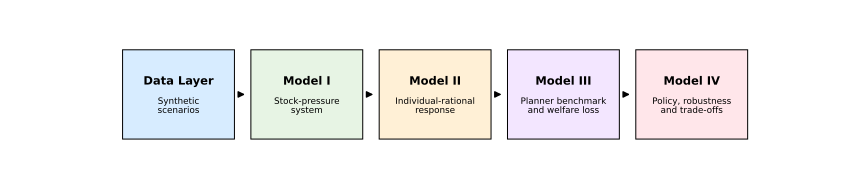
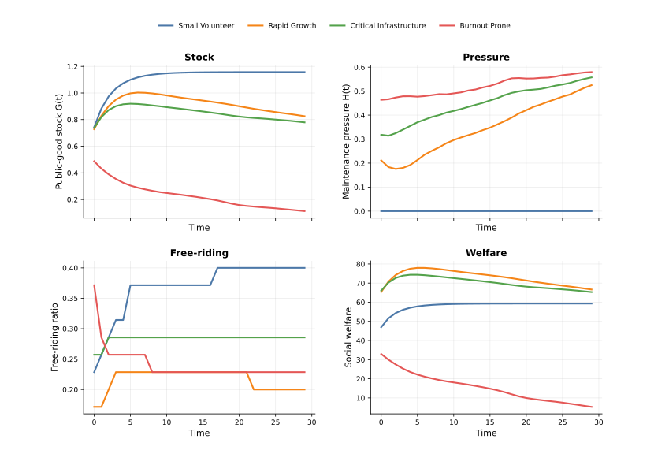
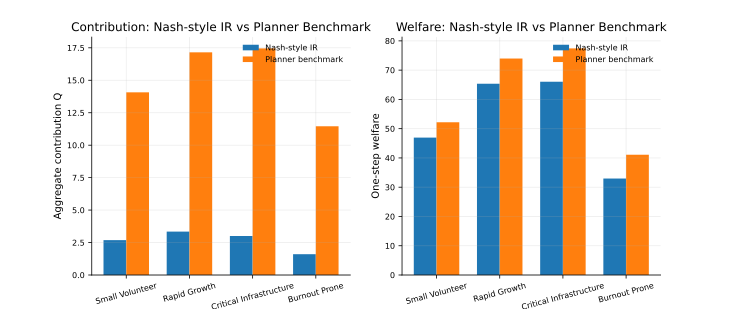
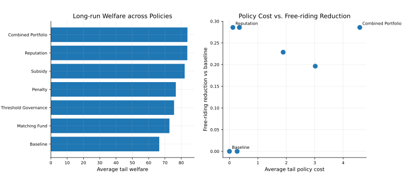
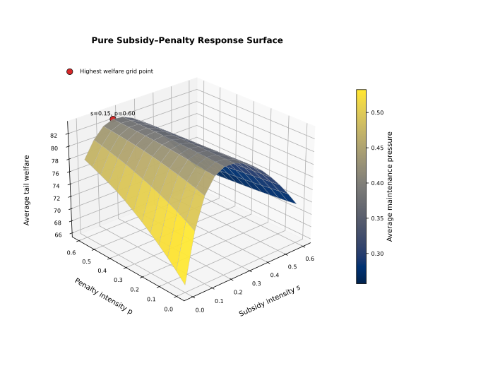
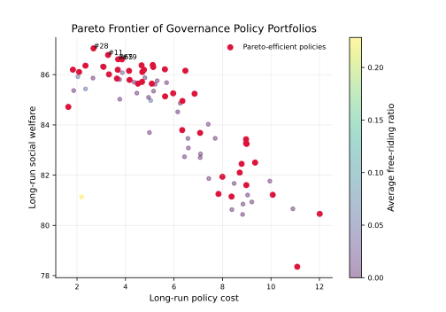
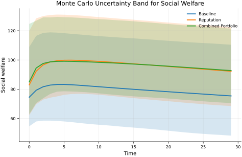

## 1. Problem Setting

This project studies free-riding behavior in dynamic public-good provision. Public goods such as environmental governance, open-source maintenance, public infrastructure, and community services share a common structure: individual contribution improves a collective stock, but the contribution cost is borne privately.

This creates a free-riding incentive. Each participant may prefer others to contribute more while reducing their own effort. As a result, decentralized individual rationality may lead to persistent under-provision, accumulated maintenance pressure, and welfare loss.

The goal of this project is to build a mechanism-oriented mathematical model that explains this dynamic process and evaluates possible governance interventions.

## 2. Modeling Framework

  

The project develops a simulation-based Dynamic Stock--Pressure Free-Riding framework. The model connects four layers:

1. controlled synthetic scenarios and heterogeneous agents;
2. dynamic stock, demand, and maintenance-pressure evolution;
3. Nash-style individual-rational decision making and a stage-wise social-planner benchmark;
4. policy intervention, robustness analysis, Monte Carlo uncertainty analysis, and Pareto trade-off evaluation.

The framework is designed as a mechanism testbed rather than an empirical forecasting model.

## 3. Dynamic Stock--Pressure System

The public-good system is represented by a stock variable $G_t$, a maintenance-pressure variable $H_t$, and a demand variable $D_t$. Each agent chooses an effort level $e_{i,t}$, and individual efforts are aggregated into effective contribution:

$$
Q_t = \sum_{i=1}^{N} a_i e_{i,t}.
$$

Because public-good production often has diminishing returns, aggregate contribution is transformed into a normalized effectiveness term:

$$
q(Q_t)=\frac{\log(1+Q_t)}{\log(1+Q_{\max})}.
$$

The public-good stock increases with effective contribution but decreases through natural decay and maintenance pressure. The pressure state accumulates through demand and is relieved by sufficient contribution. This stock--pressure coupling allows free riding to become a dynamic system-level problem rather than only a one-period behavioral problem.

## 4. Individual Rationality and Social-Planner Benchmark

The project compares two decision benchmarks under identical state conditions.

The first benchmark is a Nash-style individual-rational solution. Each agent responds to private benefit, contribution cost, pressure exposure, and policy incentives. The solution is computed by damped marginal-response updates, so it is interpreted as a stable computational proxy rather than a proven unique analytical Nash equilibrium.

The second benchmark is a stage-wise social-planner solution. The planner chooses the effort vector that maximizes total welfare in the current state while accounting for contribution cost and maintenance pressure.

The key comparison is:

$$
\text{FreeRidingGap}
=
\frac{Q^{SO}-Q^{IR}}{Q^{SO}},
$$

where $Q^{IR}$ is the decentralized individual-rational contribution and $Q^{SO}$ is the social-planner benchmark contribution.

## 5. Synthetic Scenario Design

The numerical experiments use four controlled synthetic scenarios:

- small volunteer provision;
- rapid growth;
- critical infrastructure;
- burnout-prone provision.

These scenarios are not empirical observations. They are controlled numerical environments used to separate the roles of cost, benefit, demand growth, decay, and maintenance pressure.

  

The scenario dashboard shows that stock, pressure, free-riding ratio, and welfare evolve differently across synthetic environments. This supports the need for scenario-specific policy analysis.

## 6. Free-Riding Gap and Welfare Loss

The individual-rational benchmark produces lower contribution than the social-planner benchmark across all tested scenarios. This gap is the main quantitative evidence of under-provision.

  

The model reports three related but distinct indicators:

$$
\text{FreeRidingGap}
=
\frac{Q^{SO}-Q^{IR}}{Q^{SO}},
\qquad
\text{UnderProvision}
=
\frac{G^{SO}-G^{IR}}{G^{SO}},
\qquad
\text{WelfareLoss}
=
\frac{W^{SO}-W^{IR}}{|W^{SO}|}.
$$

The free-riding gap measures the missing contribution, the under-provision ratio measures the resulting stock shortage, and the welfare-loss ratio measures the final consequence after benefits, costs, and pressure are combined.

## 7. Policy Intervention Experiments

The project evaluates six policy mechanisms in addition to the baseline:

1. subsidy;
2. penalty;
3. reputation;
4. matching fund;
5. threshold governance;
6. combined portfolio.

  

The policy comparison shows that interventions differ not only in welfare improvement but also in policy cost, free-riding reduction, maintenance-pressure relief, and effort fairness. Therefore, the project avoids claiming a universal best policy.

A policy is evaluated by a multi-criteria vector:

$$
\mathcal{E}(\pi)
=
\left(
W,
C_{\text{policy}},
\Delta FR,
\Delta H,
\text{Gini}(e),
\text{Stability}
\right).
$$

This design reflects the fact that public-good governance is a multi-objective decision problem.

## 8. Response Surface and Pareto Trade-Off

The subsidy--penalty response surface tests whether reward and deterrence act as substitutes or complements.

  

The response-surface experiment suggests that moderate reward and strong deterrence can be complementary under the implemented stock--pressure dynamics.

The Pareto analysis then searches over policy portfolios and compares welfare, stock, cost, free riding, pressure, and effort inequality.

  

The Pareto frontier is used as a decision map rather than a single optimization answer. Some high-welfare policies may be unattractive once policy cost, pressure, and fairness are considered together.

## 9. Robustness and Uncertainty

The project conducts one-dimensional sensitivity analysis, two-dimensional subsidy--penalty grid experiments, perturbed-scenario robustness checks, Monte Carlo uncertainty analysis, and Pareto policy search.

  

The Monte Carlo results show that reputation and combined-portfolio policies shift the welfare path upward relative to the baseline. Reputation is cost-effective, while the combined portfolio is more suitable when maintenance pressure and system protection are central concerns.

## 10. Main Conclusions

The numerical experiments support three mechanism-based conclusions.

First, decentralized individual rationality systematically under-provides the public good relative to the social-planner benchmark under the synthetic scenario settings.

Second, free riding should not be measured only by contribution. Its dynamic consequence appears through stock shortage, accumulated maintenance pressure, welfare loss, and unequal contribution burden.

Third, policy recommendations should be scenario-specific. Low-cost incentive correction is suitable when the system is relatively stable, while portfolio governance becomes more appropriate when maintenance pressure and reliability risks dominate.

All conclusions are conditional on the synthetic simulation design. The project does not claim empirical calibration for a specific real-world public-good system. Instead, it provides a reproducible mechanism-oriented framework for analyzing dynamic free riding and comparing governance interventions.
