## 1. Problem Setting

This project studies planar curve reconstruction from sampled points and compares three complementary viewpoints:

1. **local interpolation**, represented by cubic spline interpolation and cubic B-spline interpolation;
2. **global approximation**, represented by polynomial and B-spline least-squares fitting;
3. **frequency-domain reconstruction**, represented by truncated Fourier reconstruction for periodic closed contours.

The goal is not only to obtain visually accurate curves, but also to understand how reconstruction quality changes with parameterization, node density, noise, and harmonic truncation.

## 2. Overall Workflow

  

The workflow starts from sampled planar points, assigns a parameter value to each point, applies either interpolation or approximation models, evaluates the reconstructed curves quantitatively, and then visualizes the results on the webpage. For periodic closed contours, a Fourier branch is added to study harmonic truncation and epicycle-style reconstruction.

## 3. Parameterization

The parameter value attached to each sample point is crucial for all parametric curve models. In the code and report, a sampled curve is written as

$$
P_i=(x_i,y_i), \qquad i=0,1,\dots,n-1,
$$

and the parameter sequence is normalized to the interval $[0,1]$.

For **uniform parameterization**,

$$
t_i=\frac{i}{n-1}, \qquad i=0,1,\dots,n-1.
$$

For **chord-length parameterization**, let

$$
d_i=\lVert P_i-P_{i-1}\rVert_2, \qquad i=1,2,\dots,n-1.
$$

Then

$$
t_0=0, \qquad
\tilde t_i=\sum_{j=1}^{i} d_j,
\qquad
t_i=\frac{\tilde t_i}{\tilde t_{n-1}}.
$$

For **centripetal parameterization**, the chord increment is replaced by its square root:

$$
\tilde t_i=\sum_{j=1}^{i} \sqrt{d_j},
\qquad
t_i=\frac{\tilde t_i}{\tilde t_{n-1}}.
$$

For the **Foley--Nielsen-style parameterization** used in this project, the chord increment is adjusted by local turning angles. Let $\theta_i$ denote the turning angle at $P_i$. The implemented increment is

$$
\Delta_i
=
 d_i\left(1+\alpha\frac{\theta_{i-1}+\theta_i}{\pi}\right),
\qquad \alpha=0.5,
$$

followed by cumulative summation and normalization to $[0,1]$. Therefore, this rule is not merely a uniform or chord-length spacing rule; it gives relatively more parameter resolution to regions with stronger local bending.

## 4. Interpolation and Approximation Models

### 4.1 Cubic spline interpolation

The cubic spline interpolation model fits the two coordinate functions separately:

$$
x=x(t), \qquad y=y(t),
$$

under the interpolation constraints

$$
x(t_i)=x_i, \qquad y(t_i)=y_i.
$$

On each interval $[t_i,t_{i+1}]$, both coordinate functions are represented by cubic polynomials. The spline pieces are connected with first- and second-derivative continuity:

$$
S_i(t_{i+1})=S_{i+1}(t_{i+1}),
$$

$$
S_i'(t_{i+1})=S_{i+1}'(t_{i+1}),
\qquad
S_i''(t_{i+1})=S_{i+1}''(t_{i+1}).
$$

For open curves, the implementation uses natural boundary conditions. For closed curves, it uses periodic boundary conditions. This model is fully interpolatory and can preserve local geometric detail, but it can also inherit noise because the fitted curve is constrained to pass through the samples.

### 4.2 Cubic B-spline interpolation

The B-spline interpolation model represents the curve as

$$
C(t)=\sum_j C_j N_{j,3}(t),
$$

where $N_{j,3}(t)$ are cubic B-spline basis functions and $C_j$ are control points. In the interpolation setting, the smoothing parameter is set to zero, so the fitted curve passes through the sample points:

$$
C(t_i)=P_i, \qquad i=0,1,\dots,n-1.
$$

Compared with ordinary cubic spline interpolation, the B-spline form provides a control-point-based representation with local support, which makes it useful for smooth geometric reconstruction.

### 4.3 Polynomial least-squares fitting

For polynomial approximation, the coordinate functions are fitted globally by least squares:

$$
\min_{a,b}
\sum_{i=0}^{n-1}
\left[x_i-\sum_{k=0}^{m}a_k t_i^k\right]^2
+
\left[y_i-\sum_{k=0}^{m}b_k t_i^k\right]^2.
$$

The fitted coordinates are

$$
x(t)=\sum_{k=0}^{m}a_k t^k,
\qquad
y(t)=\sum_{k=0}^{m}b_k t^k.
$$

The normal equations are

$$
A^\top A a=A^\top x,
\qquad
A^\top A b=A^\top y,
$$

where

$$
A_{ik}=t_i^k.
$$

This method is global and smoothing by nature. It can be stable under mild noise, but it may fail on curves with strong local oscillations or complex closed boundaries.

### 4.4 B-spline least-squares fitting

The spline approximation version minimizes

$$
\min_{C_j}
\sum_{i=0}^{n-1}
\left\|P_i-\sum_j C_jN_{j,p}(t_i)\right\|_2^2.
$$

The fitted curve keeps the spline form

$$
C(t)=\sum_j C_jN_{j,p}(t).
$$

In the main experiments, the B-spline least-squares model uses cubic basis functions and a small smoothing factor proportional to the number of input points. This method combines the smoothing effect of approximation with the local support of spline bases, so it is often more stable than exact interpolation under noise.

## 5. Quantitative Metrics

The report records several geometric metrics to compare the reconstructed curve with the reference curve and the input samples.

### 5.1 Symmetric Chamfer distance

The main metric is the symmetric Chamfer distance between a dense reference point set $A$ and sampled points on the reconstructed curve $B$:

$$
d_{\mathrm{ch}}(A,B)
=
\frac{1}{|A|}\sum_{a\in A}\min_{b\in B}\lVert a-b\rVert_2
+
\frac{1}{|B|}\sum_{b\in B}\min_{a\in A}\lVert b-a\rVert_2.
$$

A smaller value indicates a better overall geometric match.

### 5.2 Average point-to-curve distance

The code also records the average distance from the original input samples to the reconstructed polyline. If $P$ is the input point set and $\Gamma_B$ is the polyline formed by the reconstructed samples, then

$$
d_{\mathrm{avg}}(P,\Gamma_B)
=
\frac{1}{|P|}\sum_{p\in P}\operatorname{dist}(p,\Gamma_B).
$$

This metric checks how well the fitted curve stays close to the observed samples.

### 5.3 Hausdorff distance

To measure worst-case geometric discrepancy, the Hausdorff distance is defined as

$$
d_{\mathrm{H}}(A,B)
=
\max\left\{
\max_{a\in A}\min_{b\in B}\lVert a-b\rVert_2,
\max_{b\in B}\min_{a\in A}\lVert b-a\rVert_2
\right\}.
$$

Unlike Chamfer distance, this metric is dominated by the largest local mismatch.

### 5.4 Smoothness and runtime

The implementation also records a discrete second-difference smoothness measure. For sampled curve points $C_i$, the open-curve version is

$$
S(C)=\frac{1}{N-2}\sum_{i=1}^{N-2}
\lVert C_{i-1}-2C_i+C_{i+1}\rVert_2.
$$

For closed curves, the same expression is evaluated with cyclic indexing. Runtime is measured for the fitting procedure and is used mainly to compare computational cost under different node counts.

## 6. Experimental Configuration

The synthetic curves are generated analytically so that reconstruction error can be evaluated against a known reference curve. The closed-curve examples include

$$
\text{circle: }(x,y)=(\cos\theta,\sin\theta),
$$

$$
\text{ellipse: }(x,y)=(1.4\cos\theta,0.8\sin\theta),
$$

$$
\text{cardioid: }(x,y)=((1-\cos\theta)\cos\theta,(1-\cos\theta)\sin\theta),
$$

$$
\text{rose: }r=\cos(5\theta),
\qquad
(x,y)=(r\cos\theta,r\sin\theta),
$$

and

$$
\text{wavy circle: }r=1+0.2\cos(6\theta)+0.1\sin(3\theta),
\qquad
(x,y)=(r\cos\theta,r\sin\theta).
$$

The open-curve examples use $x=2t-1$ and include

$$
\text{S-curve: }(x,y)=(x,\sin(\pi x)),
$$

$$
\text{cubic polynomial curve: }(x,y)=(x,0.8x^3-0.4x),
$$

and

$$
\text{sinusoidally modulated curve: }(x,y)=\left(x,0.5\sin(4\pi t)+0.25\sin(9\pi t)\right).
$$

The main fitting experiments sample each fitted curve at 500 points and compare it with a 2000-point reference curve. The interpolation-versus-approximation comparison uses 48 nonuniform input points and tests both the clean case and a mildly noisy case with $\sigma=0.02$. The parameterization comparison uses 42 nonuniform input points and cubic spline interpolation. The node-count experiment tests

$$
n\in\{12,20,32,48,72,100\}.
$$

The noise robustness experiment uses 40 nonuniform input points, five random trials, and

$$
\sigma\in\{0,0.01,0.02,0.04,0.06\}.
$$

The Fourier experiments use 80 nonuniform input points, resample each closed contour to 512 points before the Fourier transform, and reconstruct 600 curve samples for evaluation.

## 7. Main Experimental Findings

### 7.1 Method comparison

On smooth open curves such as the S-curve and the sinusoidally modulated curve, all four methods recover the overall shape, but they differ in local behavior. Interpolation methods preserve pointwise structure more directly, while least-squares models produce smoother global trends. On oscillatory or locally detailed curves, spline-based models are usually more reliable than a single global polynomial fit.

### 7.2 Parameterization

The parameterization experiments show that the spline basis alone does not determine final quality. Even with the same cubic spline interpolation model, different parameter assignments produce visibly different reconstructions. Uniform spacing is usually the weakest choice because it ignores geometric distance and local bending. Chord-length, centripetal, and Foley--Nielsen-style rules are more adaptive because they allocate parameter intervals according to the geometry of the sampled points.

### 7.3 Node density

As the number of nodes increases, fitting error generally decreases, but the rate of improvement eventually slows down. Simple shapes need only a moderate node count, while oscillatory contours such as the wavy circle require more samples because their geometry contains stronger high-frequency content.

### 7.4 Noise robustness

The robustness experiments create one of the clearest contrasts in the project. Interpolation methods inherit perturbations more directly because they are constrained to pass through the samples. Least-squares methods, especially polynomial and B-spline approximation, act as implicit smoothers and therefore maintain lower average error under noise.

The distribution plots reinforce this conclusion. The boxplot and violin plots show not only changes in average error, but also changes in variance and tail behavior. Under perturbation, interpolation-based methods tend to develop wider spreads and longer tails, while least-squares methods usually keep a tighter error distribution.

## 8. Fourier Reconstruction for Closed Curves

For periodic closed contours, the project introduces a Fourier representation based on complex samples

$$
z_j=x_j+i y_j.
$$

After resampling the contour, the truncated reconstruction with harmonic cutoff $K$ is written as

$$
\hat z(\tau)=\sum_{k=-K}^{K}c_k e^{2\pi i k\tau},
\qquad 0\leq \tau<1,
$$

where $c_k$ are Fourier coefficients computed from the sampled contour.

This gives a compact frequency-domain description of the curve:

- small $K$ preserves only the coarse global shape;
- moderate $K$ recovers dominant geometric features;
- large $K$ reproduces fine details and sharp local undulations.

The cardioid and wavy-circle examples show this progression clearly. Their static reconstructions visualize how the contour evolves as $K$ increases, and the GIF demonstrations make the epicycle interpretation directly visible. The error-versus-$K$ figures confirm the same trend quantitatively: reconstruction error drops rapidly at first and then enters a saturation regime once the dominant modes have already been captured.
