## 1. Problem Setting

This project studies periodic infectious-disease outbreaks by starting from the classical susceptible--infected--removed (SIR) model and gradually adding mechanisms that can generate recurrent epidemic behavior.

The project compares four complementary modeling viewpoints:

1. **baseline SIR dynamics**, used to explain why a single epidemic wave eventually ends;
2. **demographic SIR dynamics**, where balanced birth and death terms replenish susceptible individuals;
3. **seasonally forced SIR dynamics**, where the transmission rate varies periodically in time;
4. **stochastic epidemic simulation**, where integer-valued infection events are simulated by the Gillespie algorithm.

The goal is not only to generate epidemic curves, but also to understand how outbreak peaks, long-term recurrence, seasonal synchronization, and early stochastic fade-out are affected by transmission intensity, recovery rate, demographic renewal, forcing amplitude, population size, and initial infected count.

## 2. Overall Workflow

  

The workflow starts from the baseline SIR mechanism, analyzes the threshold condition and parameter effects, then adds demographic turnover to test whether recurrent outbreaks can arise naturally. After that, a periodic transmission rate is introduced to study seasonally organized epidemic peaks. Finally, the deterministic models are compared with stochastic Gillespie simulations to examine early fade-out in finite populations. The numerical outputs include time-series figures, peak statistics, regime classifications, and stochastic establishment summaries.

## 3. Baseline SIR Model

The deterministic part of the project uses normalized population proportions

$$
s(t)+i(t)+r(t)=1,
$$

where $s(t)$ is the susceptible proportion, $i(t)$ is the infected proportion, and $r(t)$ is the removed proportion. The baseline SIR model is

$$
\frac{ds}{dt}=-\beta s i,
$$

$$
\frac{di}{dt}=\beta s i-\gamma i,
$$

$$
\frac{dr}{dt}=\gamma i.
$$

Here $\beta$ is the transmission rate and $\gamma$ is the recovery rate. The first equation means that susceptible individuals are infected through contact with infected individuals. The second equation balances new infections and recoveries. The third equation accumulates recovered or removed individuals.

For the baseline model, the basic reproduction number is

$$
R_0=\frac{\beta}{\gamma}.
$$

At the beginning of an outbreak,

$$
\frac{di}{dt}=i(\beta s-\gamma),
$$

so the infection initially grows only when

$$
s_0>\frac{1}{R_0}.
$$

This threshold is tested numerically by changing the initial susceptible proportion $s_0$. When $s_0$ is below $1/R_0$, the infected proportion does not grow into a major outbreak; when $s_0$ is above the threshold, the infected curve can rise before eventually declining.

In the main baseline setting, the project uses

$$
\gamma=52\ \mathrm{yr}^{-1},
$$

which corresponds to a mean infectious period of approximately $7.02$ days. The baseline initial condition is

$$
(s_0,i_0,r_0)=(0.9999,10^{-4},0).
$$

The basic SIR experiments compare

$$
R_0\in\{2,8,15\},
$$

with

$$
\beta=R_0\gamma.
$$

The numerical results show that all baseline SIR trajectories have only one major infection peak. For example, when $R_0=8$, the infected proportion reaches approximately $0.615$ at about $11.5$ days and then approaches zero after susceptible depletion. Larger $R_0$ values produce earlier and higher peaks, but they do not create sustained recurrent outbreaks in the closed baseline SIR system.

## 4. Recovery-Rate and Threshold Experiments

To separate the effect of the recovery rate from the effect of $R_0$, the project fixes

$$
R_0=8
$$

and compares

$$
\gamma\in\{26,52,104\}\ \mathrm{yr}^{-1}.
$$

For each value of $\gamma$, the transmission rate is adjusted by

$$
\beta=R_0\gamma.
$$

This means the initial reproduction number is kept fixed while the epidemic time scale changes. The reported peak infected proportions are close to each other, but the peak time and outbreak duration change substantially. The peak times are approximately $23.0$, $11.5$, and $5.5$ days for $\gamma=26$, $52$, and $104$, respectively. The corresponding widths above one half of the peak are approximately $18.0$, $8.5$, and $4.0$ days.

Therefore, at fixed $R_0$, increasing $\gamma$ accelerates the epidemic clock and shortens the high-infection interval, while the overall peak size remains mainly controlled by the reproduction number and susceptible depletion.

## 5. Demographic SIR Model

The baseline SIR model cannot sustain recurrent outbreaks because the susceptible population is depleted and not replenished. To test whether recurrence can appear naturally, the project adds balanced birth and death dynamics:

$$
\frac{ds}{dt}=\mu-\beta_0 s i-\mu s,
$$

$$
\frac{di}{dt}=\beta_0 s i-\gamma i-\mu i,
$$

$$
\frac{dr}{dt}=\gamma i-\mu r.
$$

Here $\mu$ is the natural mortality rate. Births are assumed to balance deaths, so the total normalized population remains approximately constant. In this model, demographic turnover gradually replenishes the susceptible compartment, making later outbreaks possible after the initial epidemic wave.

For models with demographic turnover, the reproduction number is

$$
R_0=\frac{\beta_0}{\gamma+\mu}.
$$

When $R_0>1$, the endemic equilibrium has

$$
s^*=\frac{1}{R_0},
$$

and the infected equilibrium is

$$
i^*=\frac{\mu(1-1/R_0)}{\gamma+\mu}.
$$

The demographic experiments use

$$
\mu=\frac{1}{70}\ \mathrm{yr}^{-1},
$$

corresponding to an average lifetime of about $70$ years. The main high-transmission setting uses

$$
R_0=15,
\qquad
\beta_0=780.214\ \mathrm{yr}^{-1}.
$$

The demographic comparison shows that recurrent infection peaks can appear after the first outbreak. In the reported $40$-year experiment, $R_0=2$ produces no detected late peaks after the first year, $R_0=8$ produces $3$ detected late peaks, and $R_0=15$ produces $11$ detected late peaks. Thus, demographic replenishment is a mechanism that can create recurrent outbreaks, but the recurrent peaks are damped or organized by the interaction between susceptible renewal and disease transmission.

## 6. Seasonally Forced SIR Model

Real transmission rates are rarely constant. To represent seasonal contact changes, the project replaces the constant transmission rate by

$$
\beta(t)=\beta_0\left(1+\alpha\cos(2\pi t+\phi)\right),
$$

where $t$ is measured in years, $\alpha$ is the forcing strength, and $\phi$ is the phase. In the deterministic seasonal experiments, the default phase is $\phi=0$. The full seasonally forced demographic model is

$$
\frac{ds}{dt}=\mu-\beta(t)si-\mu s,
$$

$$
\frac{di}{dt}=\beta(t)si-\gamma i-\mu i,
$$

$$
\frac{dr}{dt}=\gamma i-\mu r.
$$

The seasonal experiments fix the demographic and recovery parameters and vary the forcing amplitude. The representative long-term curves use

$$
\alpha\in\{0,0.05,0.10,0.20,0.30,0.40,0.60\}.
$$

The long simulations remove early transients and then examine the late-stage infection curves. The project also performs a parameter scan over

$$
0\leq \alpha\leq 0.8
$$

with $61$ forcing values. For each value of $\alpha$, the code records annual samples after transient removal and detects infection peaks to summarize long-term structure.

The numerical classification divides the scan into diagnostic patterns such as small oscillation, multi-year cycle, and irregular or complex oscillation. These labels are numerical summaries rather than a rigorous bifurcation proof. In the generated classification table, the scan contains $7$ cases labeled as near equilibrium or small oscillation, $26$ cases labeled as multi-year cycle, and $28$ cases labeled as irregular or complex oscillation. The results show that stronger seasonal forcing can sharpen outbreak bursts, change the spacing between peaks, and produce more complex long-run patterns.

## 7. Stochastic Gillespie Simulation

The deterministic models treat infection as a continuous variable, but real infected counts are integers. When the number of infected individuals is small, random events can determine whether the disease establishes or fades out. To study this effect, the project implements a stochastic demographic SIR process with Gillespie simulation.

The stochastic model uses integer counts

$$
S(t)+I(t)+R(t)=N.
$$

The event rates are

$$
S+I\longrightarrow 2I,
\qquad
 a_1(t)=\frac{\beta(t)SI}{N},
$$

$$
I\longrightarrow R,
\qquad
 a_2(t)=\gamma I,
$$

$$
I\longrightarrow S,
\qquad
 a_3(t)=\mu I,
$$

$$
R\longrightarrow S,
\qquad
 a_4(t)=\mu R.
$$

A susceptible death followed immediately by susceptible replacement does not change the state, so it is omitted from the event list. The total rate is

$$
a_0(t)=a_1(t)+a_2(t)+a_3(t)+a_4(t).
$$

In the Gillespie algorithm, the waiting time to the next event is sampled from

$$
\tau\sim \operatorname{Exp}(a_0(t)),
$$

and event $k$ is selected with probability

$$
\mathbb{P}(k)=\frac{a_k(t)}{a_0(t)}.
$$

The absorbing boundary is

$$
I=0.
$$

Once the process reaches this state, the disease cannot restart unless an external infection is introduced. To distinguish early fade-out from successful establishment, the project defines

$$
\tau_0=\inf\{t:I(t)=0\},
\qquad
\tau_M=\inf\{t:I(t)\geq M\},
$$

where $M$ is the major-outbreak threshold. A major outbreak is counted when

$$
\tau_M<\tau_0,
$$

whereas early fade-out means that the process reaches $I=0$ before establishment or fails to reach the threshold within the simulation window.

Therefore, the reported stochastic probabilities describe **early fade-out before establishment**, not final extinction after a fully established large outbreak.

## 8. Numerical Methods and Experimental Configuration

The deterministic systems are solved by the fourth-order Runge--Kutta method. For an ordinary differential equation

$$
y'=f(t,y),
$$

one step with step size $h$ is

$$
\begin{aligned}
k_1&=f(t_n,y_n),\\
k_2&=f\left(t_n+\frac{h}{2},y_n+\frac{h}{2}k_1\right),\\
k_3&=f\left(t_n+\frac{h}{2},y_n+\frac{h}{2}k_2\right),\\
k_4&=f(t_n+h,y_n+hk_3),\\
y_{n+1}&=y_n+\frac{h}{6}(k_1+2k_2+2k_3+k_4).
\end{aligned}
$$

The time unit is one year. Short initial outbreaks are often reported in days for readability, while demographic and seasonal simulations are interpreted over multi-year horizons.

The main deterministic settings are:

$$
\gamma=52\ \mathrm{yr}^{-1},
\qquad
\mu=1/70\ \mathrm{yr}^{-1},
\qquad
(s_0,i_0,r_0)=(0.9999,10^{-4},0).
$$

The basic SIR comparison uses

$$
R_0\in\{2,8,15\},
$$

and the recovery-rate comparison uses

$$
\gamma\in\{26,52,104\}
$$

at fixed $R_0=8$. The demographic and seasonal main experiments emphasize the high-transmission setting $R_0=15$.

The stochastic trajectory comparison uses

$$
N=10000,
\qquad
I_0=20,
$$

with $30$ repeated sample paths. The near-threshold early fade-out experiment uses

$$
N\in\{1000,3000,10000,30000\},
$$

$$
I_0\in\{1,2,5,10\},
$$

with $100$ repeats for each parameter combination. In this experiment, the susceptible count is initialized near the epidemic threshold, and the major-outbreak threshold is approximately $0.005N$. The seasonal stochastic experiments use $N=10000$, $I_0=5$, different values of $\alpha$, and phases $0$, $\pi/2$, and $\pi$.

## 9. Quantitative Outputs

The project records both visual and tabular outputs.

The deterministic outputs include:

1. time-series curves for $S(t)$, $I(t)$, and $R(t)$;
2. comparisons across $R_0$, $\gamma$, and $s_0$;
3. demographic late-peak summaries;
4. seasonal infection curves after transient removal;
5. annual sampling diagnostics for the seasonal alpha scan;
6. peak statistics and numerical regime classification.

The stochastic outputs include:

1. sample paths compared with the deterministic demographic curve;
2. early fade-out probabilities for different $N$ and $I_0$;
3. extinction-time distributions for fade-out runs;
4. seasonal establishment probabilities under different $\alpha$ and phase values.

The generated figures are stored in the `figs/` directory in both PNG and SVG formats. The numerical tables are stored in the `results/` directory as CSV files. The report uses these figures and CSV summaries directly, so the conclusions are tied to the actual numerical outputs rather than to manually invented values.

## 10. Main Experimental Findings

### 10.1 Baseline SIR produces a single epidemic wave

The baseline SIR model explains why a closed epidemic system can end after one major outbreak. The infected proportion grows only while the effective susceptible level is high enough. Once susceptible individuals are depleted, the infection declines and approaches zero.

The $R_0$ comparison confirms this mechanism. Increasing $R_0$ from $2$ to $15$ increases the peak infected proportion and shifts the peak earlier, but it does not produce repeated large outbreaks in the baseline model. Thus, the baseline SIR model alone is not sufficient to explain sustained periodic recurrence.

### 10.2 Recovery rate controls the epidemic time scale

At fixed $R_0=8$, changing $\gamma$ changes how quickly the outbreak unfolds. Larger $\gamma$ corresponds to a shorter infectious period, and the corresponding value of $\beta$ is increased to keep $R_0$ fixed. The resulting curves have similar peak scale but different temporal widths. This shows that $R_0$ controls the strength of epidemic growth, while $\gamma$ strongly controls the calendar-time duration of the outbreak.

### 10.3 Demographic turnover enables recurrent outbreaks

With balanced births and deaths, susceptible individuals are gradually replenished after the first epidemic wave. This makes secondary outbreaks possible. In the reported demographic experiments, higher $R_0$ values lead to more visible late peaks. The $R_0=15$ setting produces repeated late peaks over the multi-year simulation window, whereas the $R_0=2$ setting does not produce detected late peaks after the first year.

This supports the conclusion that demographic turnover is a plausible internal mechanism for recurrent infection waves, although the recurrence pattern depends strongly on transmission intensity and susceptible replenishment.

### 10.4 Seasonal forcing organizes and changes long-run outbreak patterns

Seasonal forcing modifies the timing and strength of transmission. Small forcing can produce near-equilibrium or small-amplitude oscillatory behavior, while stronger forcing can generate sharper, more separated infection bursts. The alpha-scan diagnostics show transitions among small oscillations, multi-year cycles, and irregular or complex oscillations.

The phase comparison between $\beta(t)$ and $I(t)$ shows that infection peaks do not simply occur at the same time as maximum transmission. Instead, epidemic peaks depend on both the external seasonal driver and the internal accumulation of susceptible individuals.

### 10.5 Stochastic effects are important near low infected counts

The Gillespie simulations show that deterministic growth does not guarantee establishment when the infected count is small. In the near-threshold establishment experiment, the early fade-out probability depends strongly on the initial infected count and the population scale used in the threshold design.

For example, when $N=1000$, the early fade-out probability decreases from $0.81$ at $I_0=1$ to $0.02$ at $I_0=10$. For larger population sizes, the major-outbreak threshold is also larger, so establishment becomes harder under the chosen near-threshold initialization. This explains why the dependence on $N$ is not simply monotone in the reported heatmap.

### 10.6 Seasonal stochastic establishment depends on both amplitude and phase

Under phase-$0$ initialization with $N=10000$ and $I_0=5$, increasing $\alpha$ reduces early fade-out probability from $0.69$ at $\alpha=0$ to $0.05$ at $\alpha=0.6$. This indicates that strong seasonal transmission can help a small infection establish when the initial phase is favorable.

However, the phase-sensitivity experiment shows that this conclusion is phase-dependent. For example, at $\alpha=0.6$, the early fade-out probability is $0.12$ for phase $0$, but it becomes $1.00$ for phase $\pi/2$ and $0.98$ for phase $\pi$ in the reported simulations. Therefore, seasonal forcing can either promote or suppress establishment depending on where the initial infection starts within the seasonal cycle.

## 11. Interpretation

The experiments suggest the following modeling interpretation:

1. the baseline SIR model explains a single outbreak and its termination through susceptible depletion;
2. demographic turnover provides a mechanism for susceptible replenishment and recurrent outbreaks;
3. seasonal forcing can synchronize, sharpen, or complicate recurrent epidemic waves;
4. stochastic simulation is necessary when the infected count is small, because early random events can determine whether the disease establishes or fades out.

Thus, a minimal explanation of periodic outbreaks requires more than the closed baseline SIR model. Demographic renewal can create recurrent infection waves, seasonal forcing can organize those waves into periodic or multi-year patterns, and stochasticity determines whether small infection introductions survive long enough to enter the deterministic outbreak regime.
